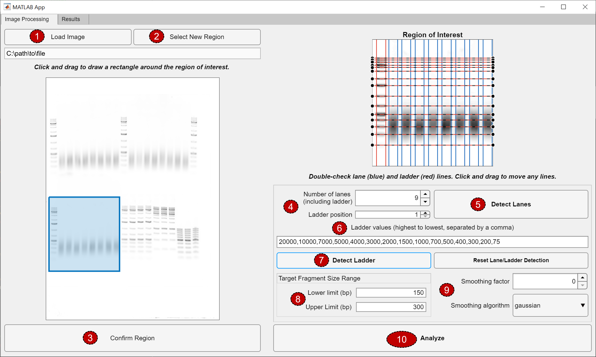
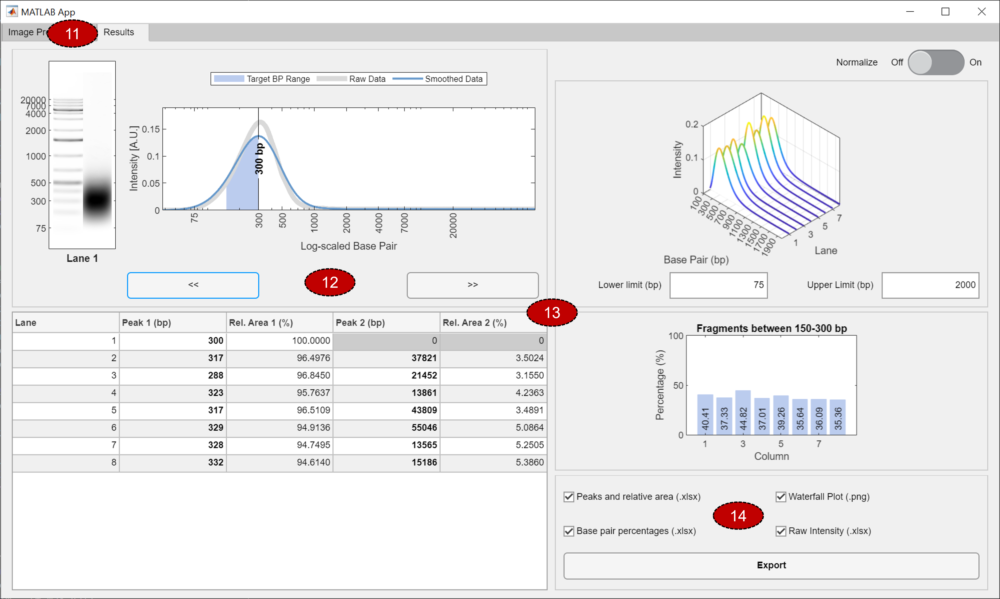

# GelInsight
GelInsight is a MATLAB-based open-source software. It exctracts base-pair  It was designed for large-sample DNA fragmentation quality control in gel electrophoresis images. 

The software extracts the following information from input gel-electrophoresis images of DNA samples:
  - base-pair size distribution
  - peak base-pair size and relative base-pair area percentage
  - percentage of fragments within a target base-pair range

---
## How to run the software 
### As a standalone Windows program
  1. Navigate to the main page of the repository.
  2. On the right, click [**Releases**](https://github.com/kjbautista/gelinsight/releases). Download and install the latest release. To install, run `GelInsightInstaller_web.exe`.
  3. MATLAB Runtime (version 9.10) is required for the software to run. The installer should automatically install MATLAB Runtime. You can also click [here](https://www.mathworks.com/products/compiler/matlab-runtime.html) for download and installation instructions. 

### As a MATLAB script
The script `GelInsight.m` can be ran directly within the MATLAB environment. 

The following programs (and recommended versions) are required:
  - MATLAB (R2021a, version 9.10)
  - Signal Processing Toolbox (version 8.6)
  - Image Processing Toolbox (version 11.3)
---
## How it works (step-by-step instructions)

  

 

  1. Click `Load Image`. Load image to process. (Supported file types: .jpg, .jpeg, .tif, .tiff, .png, .bmp)
  2. Click `Select New Region`. Click and drag to draw a rectangle around a region of interest to analyze. Adjust the rectangle accordingly to fully encompass the desired region.
  3. Click `Confirm Region` to confirm region of interest.
  4. Input the number of lanes (including the ladder) and the position of the ladder relative to the other lanes.
  5. Click `Detect Lanes` for automated lane detection. Adjust lane detections, if needed.
  6. Input comma-delimited ladder values from highest to lowest (relative to the image).
  7. Click `Detect Ladder` for automated ladder detection. Adjust ladder detections, if needed.
  8. For DNA fragmentation quality control, input the target base-pair range.
  9. Adjust the smoothing factor, where 0 applies no smoothing to the image while 1 applies maximum smoothing to the image. This will vary according to the noise present in the samples.
  10. Click `Analyze` to proceed into the Analysis.

  

 

  11. The software will automatically switch to the `Results` tab following successful analysis.
  12. Iterate through each sample to view the base-pair distribution by clicking the left and right arrows.
  13. Tables and plots provide an overview of the results.
  14. Select the desired data for export, and click `Export`. A dialog box will open. Navigate to the desired folder and input the desired file name for saving. 

---
## Copyright and Permission Notice

UNC Software GelInsight

Copyright © 2023 The University of North Carolina at Chapel Hill

All rights reserved.

The University of North Carolina at Chapel Hill (“UNC”) and the developers of GelInsight software (“Software”) give recipient (“Recipient”) permission to download a single copy of the Software in executable form and use by university, non-profit, or research institution users only, provided that the following conditions are met:
  1) Recipient may use the Software for any purpose, EXCEPT for commercial benefit.
  2) Recipient will not copy the Software.
  3) Recipient will not sell the Software.
  4) Recipient will not give the Software to any third party.
  5) Any party desiring a license to use the Software for commercial purposes shall contact:
              The Office of Technology Commercialization at UNC at 919-966-3929.

THIS SOFTWARE IS PROVIDED BY THE COPYRIGHT HOLDERS, CONTRIBUTORS, AND THE UNIVERSITY OF NORTH CAROLINA AT CHAPEL HILL "AS IS" AND ANY EXPRESS OR IMPLIED WARRANTIES, INCLUDING, BUT NOT LIMITED TO, THE IMPLIED WARRANTIES OF MERCHANTABILITY AND FITNESS FOR A PARTICULAR PURPOSE ARE DISCLAIMED. IN NO EVENT SHALL THE COPYRIGHT OWNER, CONTRIBUTORS OR THE UNIVERSITY OF NORTH CAROLINA AT CHAPEL HILL BE LIABLE FOR ANY DIRECT, INDIRECT, INCIDENTAL, SPECIAL, EXEMPLARY, OR CONSEQUENTIAL DAMAGES (INCLUDING, BUT NOT LIMITED TO, PROCUREMENT OF SUBSTITUTE GOODS OR SERVICES; LOSS OF USE, DATA, OR PROFITS; OR BUSINESS INTERRUPTION) HOWEVER CAUSED AND ON ANY THEORY OF LIABILITY, WHETHER IN CONTRACT, STRICT LIABILITY, OR TORT (INCLUDING NEGLIGENCE OR OTHERWISE) ARISING IN ANY WAY OUT OF THE USE OF THIS SOFTWARE, EVEN IF ADVISED OF THE POSSIBILITY OF SUCH DAMAGE.

